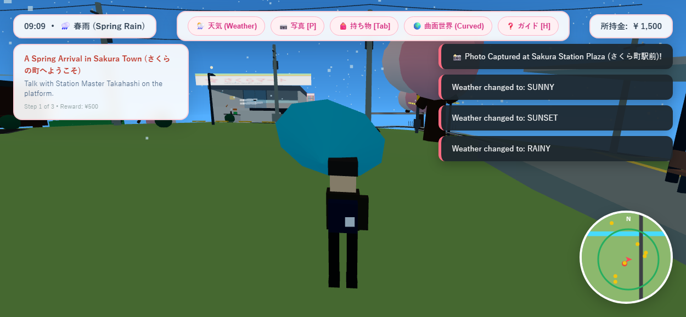

# 🌸 桜花小鎮 (Sakura Town)

> **3D 开放式日系动画风格模拟小镇游戏 (3D Anime Open Living Simulation Game)**  
> 基于 **Three.js + Vite + TypeScript** 原生构建，纯代码程序化生成几何体、材质、贴图、音效与全套生活系统，零外部素材依赖，100% 独立闭环运行。

---

## 📸 游戏实机截图 (Game Screenshot)



---

## 🌟 项目设计与核心特色

本项目严格遵循《樱花小镇（Sakura Town）详细版提示词》规范，打造了一个**紧凑、高密度、具有真实生活感与内在因果逻辑的小世界**：

> “这个小镇不是因为玩家出现才开始运转；即使玩家什么都不做，它也会继续生活。”

### 1. 🎨 统一的美术基准 (Art Direction & World Setting)
- **审美语言**：当代日本地方铁道乡镇，融入昭和与平成时期的温情生活痕迹。
- **色彩与渲染**：日式动画背景感 Cel-shading / Toon 材质，暖调日光与冷调柔和漫反射；程序化生成的日本路标、点字砖、招牌、踏切标志与便利店招牌。
- **曲面世界 (Curved World)**：内置动画电影般的曲面地平线顶点位移着色器，可在 HUD 中一键切换曲面/平面视界，带来如《小王子》《动物森友会》般的童话行星感。

### 2. 🚆 真实运行的铁道交通与道口系统 (Railway & Fumikiri)
- **环形铁道闭环**：两节编组的经典江之电式绿白涂装电力动车组（EMU），在贯穿全镇的平滑闭环轨道上行驶。
- **真实运行逻辑**：列车经历巡航加速、减速进站、精准停靠、发车音乐（発車メロディ）、气动车门开启、旅客乘降、鸣笛出发全流程。
- **踏切道口联动 (Fumikiri)**：当列车接近中心十字路口，黄黑相间道口栏杆自动降下，双红警示灯交替闪烁，伴随真实 700Hz/750Hz 铁道警报铃声，真实物理屏障阻挡行人和车辆。
- **可实际乘坐**：玩家可在站台车门开启时按 `[E]` 步入车厢，以乘客视角环游全镇，越过铁桥与水渠，再于樱花町站下车！

### 3. 🏠 真正可进入的建筑室内 (Fully Enterable Interiors)
- **さくらマート (Sakura Mart 24H 便利店)**：
  - 感应式自动玻璃移门，走近时伴随经典便利店门铃声自动滑开；
  - 内部具备发光饮料冷柜、双排零食货架、饭团便当展示台、杂志架、收银台、微波炉、关东煮/炸鸡保温柜；
  - 支持打工系统：在收银台体验兼职收银，赚取日元酬劳！
- **珈琲 木漏れ日 (Cafe Komorebi 咖啡馆)**：
  - 深色实木与暖白灰泥装潢，设有手冲咖啡吧台、意式咖啡机、黑板菜单与临河观景露台；
  - 店主健二在此冲泡慢调咖啡，玩家可点单恢复体力。
- **桜井家 (玩家双层独栋住宅)**：
  - 下沉式玄关与鞋柜、传统榻榻米和室（置有暖桌 Kotatsu 与茶具）、厨房操作台、燃气灶与冰箱（可开启饮用冰麦茶）；
  - 2楼设日式床褥与学习书桌（台灯可开关），推开移门可至樱花树旁的露天阳台；在床上休息可快进时间至次日早晨 07:00 并回满体力。
- **さくら神社 (山顶神社)**：
  - 朱红大鸟居、石阶参道、常夜石灯笼（夜间点亮烛光）、手水舍（流动竹筒泉水）；
  - 拜殿与巨大御神铃、木质赛钱箱（投掷 5 日元硬币祈福，触发二礼二拍手一礼并获得全回复祝福）；
  - 御神签（Omikuji）摇签筒（可抽取大吉、中吉等签文与幸运物）、绘马架与千年结绳御神木。
- **町立南学校 (小镇学校)**：
  - 铁艺校门与自行车棚、带钟楼的教学楼、操场足球门；
  - 1楼教室可进入：木质地板、写有日直与作业的教学黑板、讲台与学生课桌椅。

### 4. 👥 鲜活的居民日常与生态 (Living NPCs & Daily Life)
小镇常住居民各自拥有独立姓名、居所、作息表与关系网：
1. **ひな (Hina)**：便利店店员，清晨通勤、白天收银理货、傍晚在河畔散步；
2. **佐藤さん (Sato-san)**：神社长者，清晨清扫参道落叶、午后河边喂鸟散步、日落时在观景台赏景；
3. **葵 (Aoi)**：初中生美术生，在学校教室上课，放学后在河畔写生樱花树；
4. **蓮 (Ren)**：活力中学生，热衷足球与骑单车，傍晚在神社绘马前驻足；
5. **高橋駅長 (Takahashi-san)**：35 年敬业站长，在站台巡视车次与乘客安全；
6. **健二 (Kenji)**：咖啡馆老板，专注手冲咖啡与黑胶唱片；
7. **ミカン (Mikan)**：镇上的三色猫，穿梭于便利店前晒太阳、木桥栏杆与御神木下，可被玩家抚摸互动并发出呼噜声与喵叫。
- **环境因果反应**：下雨时居民与玩家会自动撑开雨伞；居民相遇会停步寒暄；路过玩家时会转头目送。

### 5. 🚲 交通与骑行体验 (Rideable Mamachari Bicycle)
- 原汁原味的日式“妈妈车”实用自行车：前置网眼菜篮、镀铬挡泥板、车架、脚踏板、车铃与夜间前灯。
- 按 `[B]` 随地骑乘，拥有真实加减速与转弯倾角（Banking），车轮与曲柄真实旋转，按 `[F]` 敲响清脆车铃（"Rin-Rin!"）。

### 6. 🔊 100% 纯程序化 Web Audio 声音引擎
不依赖任何外部音频文件，完全利用 Web Audio API 合成真实听觉世界：
- **铁道音效**：踏切警报铃（交替 700Hz/750Hz 纯正金属铃声）、发车旋律（発車メロディ 明亮五音和弦）、列车轮轨咬合声、电笛汽笛；
- **自然声景**：随风摇曳的风声（滤波粉红噪声）、春季山雀鸟鸣（Uguisu 莺鸣频率扫描）、春雨淅沥声；
- **交互音效**：沥青/木板/榻榻米脚步声、移门滑轨声、自动售货机投币与落罐声、开罐啜饮声、便利店迎宾门铃、投币神社拍手声、单车铃声；
- **BGM**：合成器循环演奏的治愈系 Lo-Fi 钢琴曲（Bbmaj7 - C7 - Am7 - Dm7 吉卜力经典和弦走向）。

### 7. 📸 樱花快门与主线剧情 (Sakura Snap & Quests)
- **樱花快门 (Sakura Snap)**：按 `[P]` 进入相机取景框，支持调整滤镜（日系温暖、复古胶片、落樱绽放），拍摄照片自动保存在地相册。
- **5 章连贯主线剧情**：
  - 第一章：初来乍到（拜访高桥站长与雏，登记小镇生活）
  - 第二章：三色猫的失落铜铃（在河畔草丛寻找失落的铃铛还给佐藤爷爷）
  - 第三章：午后樱饼之约（骑车帮雏从咖啡店取来新鲜抹茶）
  - 第四章：绘马上的心愿（探查绘马架，为莲与葵传递友谊与鼓励）
  - 第五章：黄昏铁道（日落时分拍摄电车驶过铁桥的唯美瞬间）
- **持久化保存 (Save System)**：自动将玩家位置、日元存款、背包物品、任务进度、好感度与时间保存至浏览器 LocalStorage。

---

## 🎮 操作指南 (Controls)

| 按键 | 功能 |
| :--- | :--- |
| **W / A / S / D** 或 **方向键** | 控制角色在小镇道路与建筑中移动 |
| **Shift** | 疾跑 (Sprint) |
| **Space** | 跳跃 / 跨上台阶 |
| **鼠标拖动** | 自由平滑旋转视角，滚轮缩放镜头远近 |
| **E** | **通用交互键** (与居民对话、开关移门、自动售货机买饮料、乘坐列车、神社投币祈福、抽御神签、收银台购物) |
| **B** | **骑乘 / 停放自行车** (Mamachari) |
| **F** | 骑车时敲响自行车铃铛 ("Rin-Rin!") |
| **P** | 进入 / 退出 **樱花快门相机模式 (Sakura Snap)** |
| **Tab** | 打开 / 关闭 **背包与物品栏 (Backpack)** |
| **H** | 打开 / 关闭 **操作指引面板 (Help Modal)** |
| **Esc** | 关闭当前打开的任何弹窗或菜单 |

---

## 🚀 启动与构建指南 (How to Run)

本项目无需任何预处理工具，环境要求：`Node.js >= 18`。

### 1. 运行本地开发服务器
```bash
# 启动 Vite 开发服务器 (支持热重载)
npm run dev
```
启动后在浏览器打开显示的地址（如 `http://localhost:3000/`）即可畅玩。

### 2. 构建生产版本与预览
```bash
# 检查 TypeScript 类型并进行生产打包
npm run build

# 预览生产版本
npm run preview
```
打包产物位于 `dist/` 目录，可直接托管在任何静态 Web 服务器或 GitHub Pages 上。

---

## 📁 目录结构与架构设计

```text
sakura_town/
├── index.html                   # 游戏宿主入口、启动动画与视口配置
├── package.json                 # 依赖配置 (Three.js, TypeScript, Vite)
├── tsconfig.json                # TypeScript 编译器配置
├── vite.config.ts               # Vite 构建与本地服务配置
├── sakura_town_detailed.md      # 原始项目需求设计书
└── src/
    ├── main.ts                  # 游戏总入口，60fps 主循环与系统调度
    ├── types.ts                 # 核心数据接口定义 (天气、NPC、任务、物品)
    ├── engine/
    │   ├── AudioSynthesizer.ts  # 100% 纯程序化 Web Audio 合成音效与背景音乐
    │   ├── CelShaders.ts        # Cel/Toon 材质与曲面地平线顶点位移 Shader
    │   ├── Physics.ts           # 地形高度场、平滑上下台阶与 AABB 碰撞检测
    │   └── TextureGenerator.ts  # Canvas 绘制日本路标、招牌、水纹与黑板等贴图
    ├── world/
    │   ├── FoliageAndProps.ts   # 樱花树、电线杆拉线、售货机、路灯与街头设施
    │   ├── LightingSky.ts       # 24小时动态天穹、流云、星空、日照与夜间泛光
    │   ├── TerrainAndRoads.ts   # 樱花川水渠、太鼓桥、沥青道路、点字盲道与台阶
    │   └── Weather.ts           # 樱吹雪落樱粒子、雨滴粒子、雨伞响应与路面反光
    ├── buildings/
    │   ├── CafeKomorebi.ts      # 室内咖啡馆：实木吧台、手冲器具与临河露台
    │   ├── PlayerHouse.ts       # 双层和风住宅：玄关、暖桌榻榻米、厨房、阳台
    │   ├── RailwayCrossing.ts   # 踏切道口：黄黑起落杆、双闪警示灯与警报铃声
    │   ├── SakuraMart.ts        # 24H便利店：感应自动玻璃门、货架、冷柜、收银台
    │   ├── SakuraShrine.ts      # 鸟居、常夜灯、手水舍、赛钱箱祈福与御神签
    │   ├── SakuraStation.ts     # 车站站台、雨棚、站名牌、IC闸机与时刻表
    │   └── TownSchool.ts        # 校园操场、钟楼、黑板与课桌椅教室
    ├── vehicles/
    │   ├── Bicycle.ts           # 妈妈车自行车：转向倾角、车轮曲柄旋转与车铃
    │   └── Train.ts             # 2节编组通勤电车：闭环轨道动力学、到站开门与乘车
    ├── characters/
    │   ├── AvatarGenerator.ts   # 3D Anime 人物、动作（步行/撑伞/骑车）与三色猫
    │   └── NPCSystem.ts         # 7位居民 24小时生活日程、对话分支与社交互动
    ├── gameplay/
    │   ├── InteractionManager.ts# 近邻目标扫描与 [E] / [B] 上下文交互提示
    │   ├── InventorySystem.ts   # 背包道具、体力回复与日元货币经济系统
    │   ├── PhotographySystem.ts # 樱花快门：滤镜、智能场景识别与相册保存
    │   ├── PlayerController.ts  # 丝滑第三人称相机、障碍避障、步行/疾跑/跳跃
    │   ├── QuestManager.ts      # 5章连贯生活任务、步骤指引与丰厚奖励
    │   └── SaveManager.ts       # LocalStorage 本地存档与断点恢复
    └── ui/
        └── UIManager.ts         # Anime UI 悬浮面板、时间天气、雷达小地图与对话框
```

---

🌸 **祝您在樱花小镇的晚春微风与清脆踏切声中度过一段温暖治愈的时光！**
